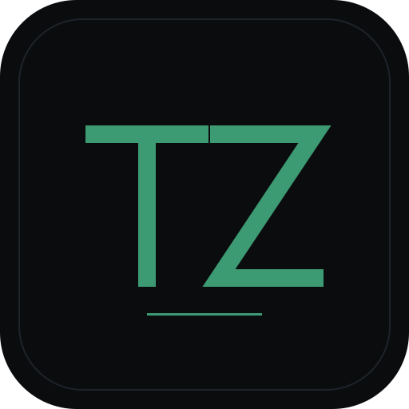
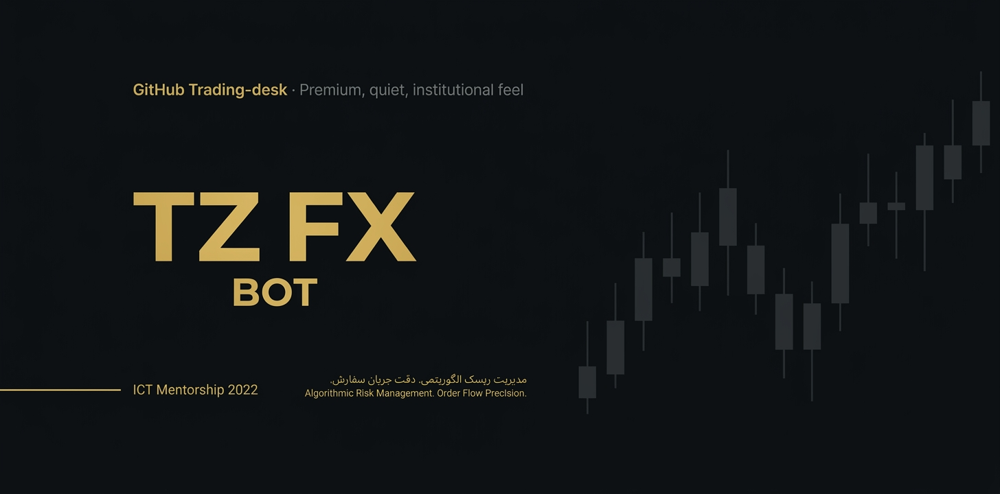
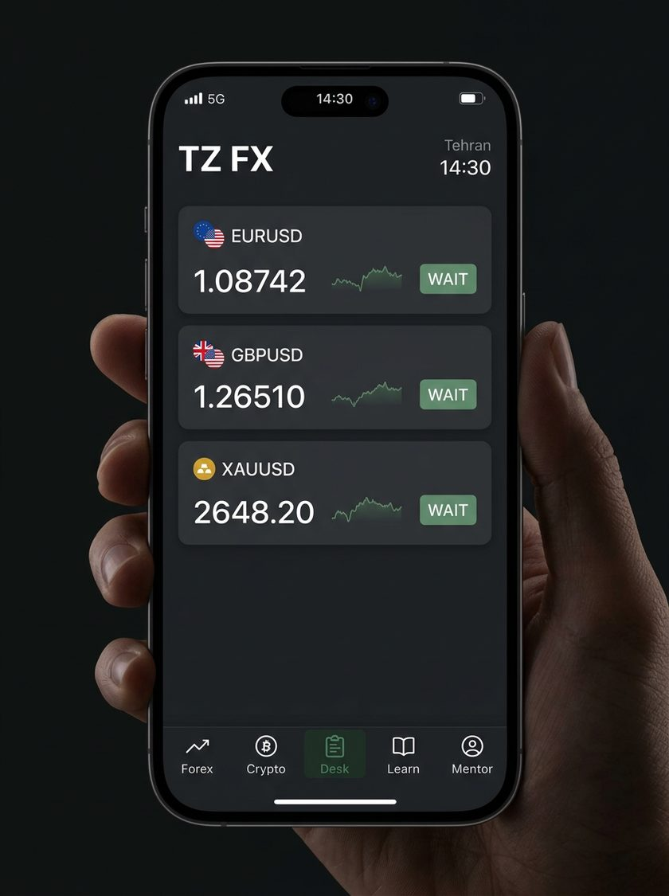
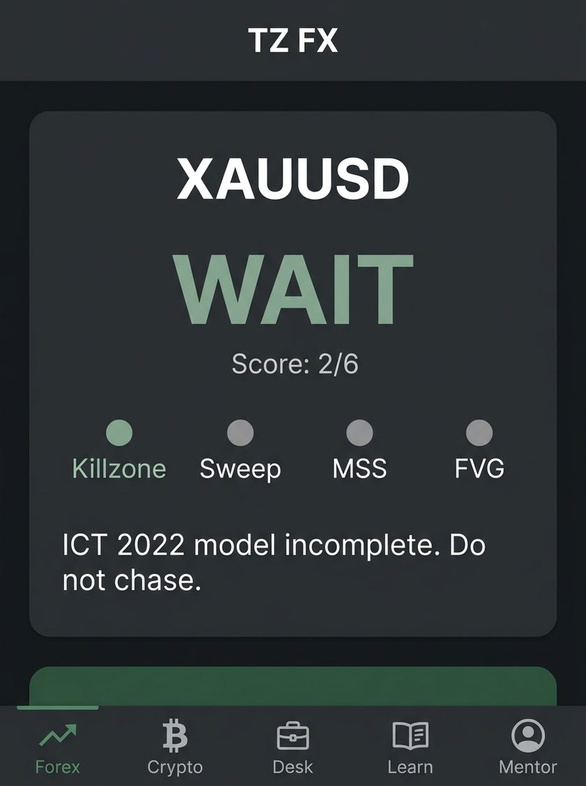
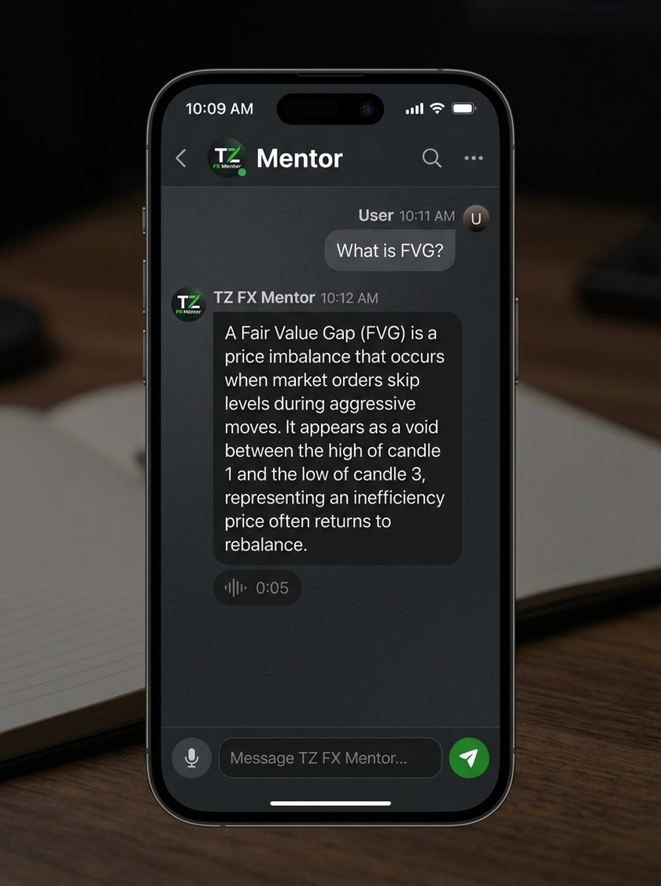
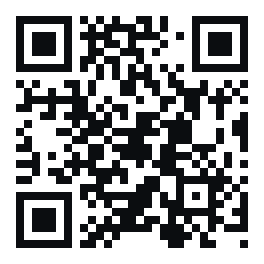
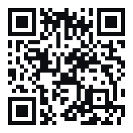

<p align="center">
  
</p>

<h1 align="center">TZ FX BOT</h1>

<p align="center">
  دستیار معامله در تلگرام · اسکنر ICT<br/>
  Telegram trading assistant · ICT market scanner
</p>

<p align="center">
  <strong>صبر / WAIT</strong> یک خروجی واقعی است. حد ضرر اجباری است.<br/>
  <strong>WAIT</strong> is a first-class state. Stop loss is required.
</p>

<p align="center">
TZ FX BOT دستیار معامله در تلگرام است: اسکنر ICT برای یورو، پوند، طلا و کریپتو اسپات USDT.
مدل ناقص یعنی صبر. سیگنال زنده همیشه حد ضرر دارد.
مینی‌اپ، ۲۶ درس، مربی با حافظه جدا، دفتر پیپر، اتصال دمو به صرافی و MT5.
آموزشی است — مشاوره مالی نیست و سود را تضمین نمی‌کند.
</p>

<p align="center">
TZ FX BOT is a Telegram ICT scanner for EURUSD, GBPUSD, XAUUSD and USDT-spot crypto.
Incomplete geometry returns WAIT. Live setups always include a stop loss.
Mini App, 26 lessons, per-user mentor, paper desk, demo-gated CEX and MT5.
Educational software — not financial advice.
</p>

<p align="center">
  <a href="https://t.me/TZ_FX_BOT">Open bot</a>
  ·
  <a href="docs/README.md">Docs</a>
  ·
  <a href="#فارسی">فارسی</a>
  ·
  <a href="#english">English</a>
  ·
  <a href="https://github.com/E30TZ/tz-fx-bot">Source</a>
  ·
  <a href="https://t.me/E30TZ">EHSAN TZ</a>
</p>

<p align="center">
  <a href="https://t.me/TZ_FX_BOT"></a>
  <a href="LICENSE"></a>
  <a href="CHANGELOG.md"></a>
  
</p>

<p align="center">
  
</p>

<p align="center">



</p>

<p align="center"><sub>پیش‌نمایش رابط با دادهٔ نمایشی. دفتر زنده و ادعای سود نیست.<br/>Interface preview with demonstration data. Not a live book. Not a performance claim.</sub></p>

---

<div dir="rtl" lang="fa">

## فارسی

زبان پیش‌فرض محصول **فارسی** است. انگلیسی هم سطح اول است و برای هر کاربر تلگرام جدا ذخیره می‌شود.

ربات: [@TZ_FX_BOT](https://t.me/TZ_FX_BOT) · کانال رایگان: [@TZ_FX_CH](https://t.me/TZ_FX_CH) · توسعه‌دهنده: [@E30TZ](https://t.me/E30TZ)

### معرفی

TZ FX BOT ربات تلگرام و مینی‌اپ برای اسکن فارکس و کریپتو اسپات USDT با مدل **ICT** است.

موتور سمت را از خودش نمی‌سازد. اگر مدل ICT کامل نباشد خروجی **صبر / WAIT** است. اگر کامل باشد سیگنال **با حد ضرر** است. تعقیب قیمت ممنوع است. درصد برد ساختگی چاپ نمی‌شود.

این ریپو درخت عمومی است. رازها روی هاست می‌مانند.

### قابلیت‌ها

| | |
|---|---|
| اسکنر | EURUSD، GBPUSD، XAUUSD و کریپتو اسپات USDT. ساعت تهران. |
| ICT | کیل‌زون، سوئیپ، جابه‌جایی، FVG، OTE، آرایه PD. امتیاز ۰ تا ۶. |
| صبر | هندسه ناقص یک حالت منتشرشده است، نه خطای خاموش. |
| مینی‌اپ | میز تیره: فارکس، کریپتو، میز، آموزش، مربی. |
| مربی | حافظه جدا برای هر کاربر. ویس داخل، متن و ویس خارج. |
| آموزش | ۲۶ درس، پنج سطح، تا API و اتصال بروکر. |
| پیپر | دفتر جدا. وین‌ریت کانال نیست. |
| اتصال | REST صرافی + صف پل MT5. تا وقتی عوض نکنی `LIVE_MODE=demo`. |
| زبان | `/lang`، دکمه خانه، چیپ مینی‌اپ. |

### موتور معامله

قفل روی مدل ICT.

1. کشش HTF → سوئیپ Judas → MSS با جابه‌جایی → ورود داخل FVG/OTE → حد ضرر پشت ویک.
2. سمت زنده فقط با امتیاز ۳ یا بیشتر. پایین‌تر: **صبر**.
3. بدون حد ضرر، سمت زنده نیست.
4. قیمت ساختگی نیست. تعقیب نیست. مولتی‌ستاپ نیست.
5. فقط دفتر بسته‌شده. درصد برد جعلی نیست.
6. شنبه فارکس بسته است. کریپتو اسپات USDT است و بتا.
7. سقف ریسک ۱٪. متن آموزشی روی میز است.

در PR این قفل را شل نکن.

### تلگرام

`/start` خانه را **پایین چت** می‌فرستد. دکمه‌های میز همان پیام را ادیت می‌کنند.

فهرست قابلیت‌ها: [docs/FEATURES.md](docs/FEATURES.md)

`/start` `/signal` `/crypto` `/learn` `/tools` `/wr` `/lang` `/help` `/donate`

اضافهٔ مالک: `/connect` `/paper` `/admin`

پرداخت: عضویت [@TZ_FX_CH](https://t.me/TZ_FX_CH) بعد کارت و رسید. مالک VIP را تأیید می‌کند ([لینک](https://t.me/+uWnJTwhqC_FhMmM8)). کریپتو بتا: [لینک](https://t.me/+8hM_fEp9y7Y0ZmQ8).

### نصب

**CGI**

```bash
python3 -m pip install -r requirements.txt
cp .env.example .env
# توکن → .telegram_token  (فایل، نه تاریخچه شل)
python3 tests/test_i18n.py && python3 tests/test_repo.py
```

وب‌هوک را به مسیر CGI بده. توکن را در git نگذار.

**سرور اوبونتو** — [docs/VPS.md](docs/VPS.md)

```bash
git clone https://github.com/E30TZ/tz-fx-bot.git
cd tz-fx-bot
sudo bash scripts/install-vps.sh
```

توکن: `/opt/tz-fx-bot/.telegram_token`. `LIVE_MODE=demo` بماند تا خودت عوض کنی.

### امنیت

[SECURITY.md](SECURITY.md). اگر توکن یا رسید لو رفت در ایشوی عمومی ننویس — به [@E30TZ](https://t.me/E30TZ) بگو.

### سلب مسئولیت

نرم‌افزار آموزشی است. مشاوره مالی نیست. کارگزار نیست.

بازار می‌تواند موجودی را صفر کند. TZ FX سود تضمین نمی‌کند، پول کسی را مدیریت نمی‌کند، دونیت را سرمایه نمی‌داند.

حد ضرر اجباری است. حداکثر ۱٪. سود تضمینی نیست.

</div>

---

<div dir="ltr" lang="en">

## English

Persian is the product default. English is a first-class UI language, stored in `i18n.py`, persisted per Telegram user.

Bot: [@TZ_FX_BOT](https://t.me/TZ_FX_BOT) · free channel: [@TZ_FX_CH](https://t.me/TZ_FX_CH) · developer: [@E30TZ](https://t.me/E30TZ)

### Overview

TZ FX BOT is a Telegram bot and Mini App that scans FX and USDT-spot crypto against **ICT**.

The engine does not invent a side. Incomplete ICT geometry returns **WAIT**. A complete model returns a setup **with a stop loss**. No chase. No fabricated win-rate.

This repository is the public tree. Secrets stay on the host.

### Features

| | |
|---|---|
| Scanner | EURUSD, GBPUSD, XAUUSD + USDT-spot crypto. Tehran clock. |
| ICT | Killzone, sweep, displacement, FVG, OTE, PD array. Score 0–6. |
| WAIT | Incomplete geometry is a published state, not a silent failure. |
| Mini App | Dark desk: Forex, Crypto, Desk, Learn, Mentor. |
| Mentor | Isolated per-uid memory. Voice in, text + voice out. |
| Education | 26 lessons, five levels, through API / broker connect. |
| Paper | Separate book. Not the channel win-rate. |
| Connect | CEX REST + MT5 bridge queue. `LIVE_MODE=demo` until you change it. |
| Language | `/lang`, home switcher, Mini App chip. |

### Trading engine

The scanner is locked to the ICT model.

1. HTF draw → Judas sweep → MSS with displacement → enter inside FVG/OTE → SL beyond the wick.
2. Live side requires score ≥ 3. Below that: **WAIT**.
3. No stop loss → no live side.
4. No invented prices. No chase. No multi-setup mashup.
5. Closed book only. No fabricated win-rate.
6. Saturday FX is closed. Crypto is USDT spot, beta.
7. Risk cap 1%. Educational disclaimer on the desk.

Do not loosen this in a pull request.

### Telegram

`/start` posts home at the **bottom** of the chat. Desk buttons edit that card.

Capability index: [docs/FEATURES.md](docs/FEATURES.md)

`/start` `/signal` `/crypto` `/learn` `/tools` `/wr` `/lang` `/help` `/donate`

Owner extras: `/connect` `/paper` `/admin`

Paywall: join [@TZ_FX_CH](https://t.me/TZ_FX_CH), then card + receipt. Owner confirms VIP ([invite](https://t.me/+uWnJTwhqC_FhMmM8)). Crypto beta: [invite](https://t.me/+8hM_fEp9y7Y0ZmQ8).

### Architecture

```
Telegram  ──webhook──►  WSGI / CGI
                         ├─ ICT scan
                         ├─ i18n.t(lang, key)
                         ├─ Mini App API
                         ├─ mentor
                         └─ live_exec (demo) ──► MT5 bridge
```

| File | Role |
|---|---|
| `telegrambot_bot.py` | Bot, webhook, Mini App API, ICT, mentor, paywall |
| `i18n.py` | FA / EN catalog + 26 English lessons |
| `miniapp.html` | Mini App |
| `live_exec.py` | Demo-gated CEX + MT5 queue |
| `tz_mt5_bridge.py` | Windows MT5 poller |
| `chart_pro.py` | Charts: price, SL, TP |
| `scripts/install-vps.sh` | Ubuntu installer |

Hourly FX scan does not attach a chart. Signal charts draw price + SL + TP only. Channel FX is silent 20:30–08:30 Tehran; in-bot DM is 24/7 and still WAIT when empty.

### Installation

**CGI**

```bash
python3 -m pip install -r requirements.txt
cp .env.example .env
# token → .telegram_token  (file, not the shell history)
python3 tests/test_i18n.py && python3 tests/test_repo.py
```

Point the webhook at the CGI path. Keep tokens off git.

**Ubuntu VPS** — [docs/VPS.md](docs/VPS.md)

```bash
git clone https://github.com/E30TZ/tz-fx-bot.git
cd tz-fx-bot
sudo bash scripts/install-vps.sh
```

Token: `/opt/tz-fx-bot/.telegram_token`. Leave `LIVE_MODE=demo` until you change it.

Host files: `.telegram_token`, mentor key, `.live.json`, `.edu_audio/`. See [`.env.example`](.env.example).

### Security

[SECURITY.md](SECURITY.md). If a live token or receipt leaked, do not open a public issue — Telegram [@E30TZ](https://t.me/E30TZ).

### Roadmap

Not a date promise. Not a return promise.

- Remaining Persian lesson audio (`edu_19`, `edu_20`, `edu_23`, `edu_24`, `edu_26`)
- English lesson audio when quota allows

Out of scope: loosening ICT, fake win-rate, guaranteed profit.

### Contributing

[CONTRIBUTING.md](CONTRIBUTING.md). ICT lock, required SL, and WAIT are not negotiable in a drive-by PR.

### Custom development

[EHSAN TZ](https://github.com/E30TZ) · [@E30TZ](https://t.me/E30TZ)

Scoped work — not a clone of TZ FX signals: Telegram bots, web applications, APIs, automation, software products.

### Disclaimer

Educational software. Not financial advice. Not a broker.

Markets can wipe a deposit. TZ FX does not guarantee profit, does not manage your money, and does not treat a donation as a stake.

</div>

---

## Support TZ FX

<div dir="rtl" lang="fa">

**حمایت از TZ FX**

اگر TZ FX برای شما مفید بوده، می‌توانید با ارسال دونیت از توسعه و نگهداری پروژه حمایت کنید.

</div>

**Support TZ FX**

If TZ FX has been useful to you, you can support continued development with a donation.

Donation only — not an investment, not a deposit, not a managed account. No return.

⚠️ Always select the exact network shown. Sending assets through the wrong network may result in permanent loss.

⚠️ هنگام انتقال، شبکه را دقیقاً مطابق شبکه نمایش‌داده‌شده انتخاب کنید. انتقال روی شبکه اشتباه ممکن است باعث از دست رفتن دارایی شود.

<table>
<tr>
<td valign="top" width="50%">

**TRX — TRON**



```
TF4TbyEu1eC1sYTW1oviBbmPKT1KkxViba
```

</td>
<td valign="top" width="50%">

**TON — TON**


```
UQDKUFjOEWXcyjOE459jWbniQRtdNYN1taRRn1XhdA8KKiqT
```

</td>
</tr>
<tr>
<td valign="top" width="50%">

**USDT — TRC20**


```
TF4TbyEu1eC1sYTW1oviBbmPKT1KkxViba
```

Not ERC-20 / BEP20 / TON.

</td>
<td valign="top" width="50%">

**USDT — BEP20**



```
0x258380877EC849e04082C4A6795d01432c3F4B7B
```

Not TRC20 / ERC-20 / TON.

</td>
</tr>
</table>

No other wallets.

---

## License

[MIT](LICENSE) © 2026 EHSAN TZ
