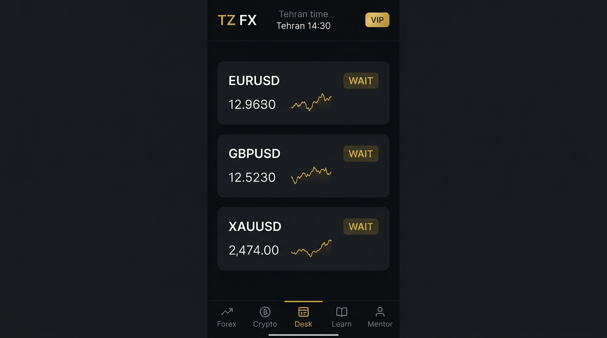
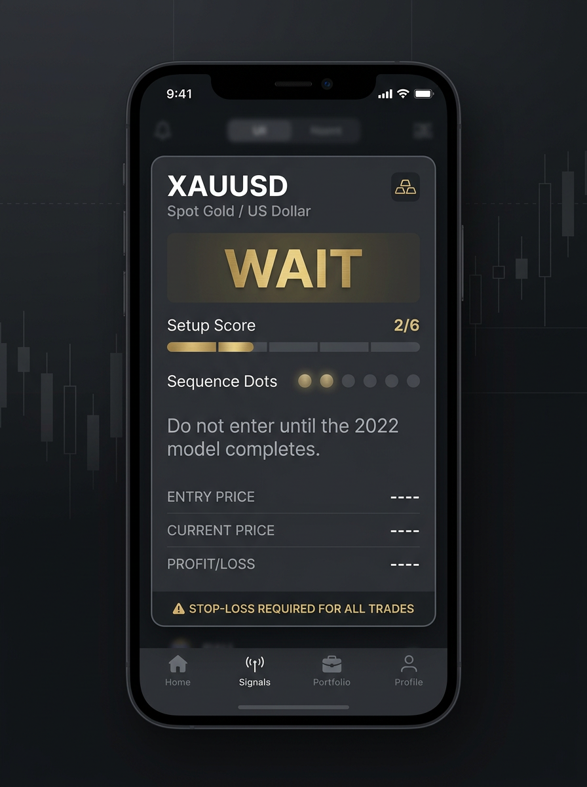
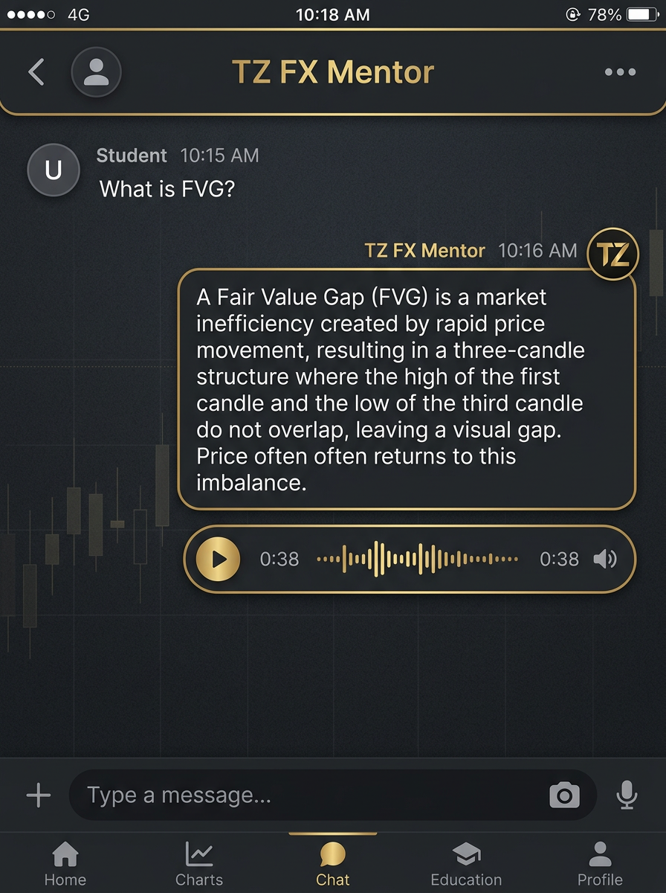

# TZ FX BOT

**ICT Mentorship 2022 signals. Persian default. English first-class. No chase. Stop loss required.**

Telegram bot + dark Mini App for Tehran-time FX (EURUSD, GBPUSD, XAUUSD) and USDT-spot crypto. The engine either prints a full ICT 2022 setup **with SL** or it prints **WAIT**. It does not invent BUY/SELL.

Developer: **E30TZ** · Telegram [@E30TZ](https://t.me/E30TZ)

| | |
|---|---|
| Bot | [@TZ_FX_BOT](https://t.me/TZ_FX_BOT) |
| Free channel | [@TZ_FX_CH](https://t.me/TZ_FX_CH) |
| VIP | [invite](https://t.me/+uWnJTwhqC_FhMmM8) |
| Crypto beta | [invite](https://t.me/+8hM_fEp9y7Y0ZmQ8) |
| Webhook / Mini App | `https://ehsantz.pingbaz.space/bot/index.cgi` |

---

## فارسی

ربات و مینی‌اپ معامله با مدل **ICT Mentorship 2022**. زبان پیش‌فرض فارسی است؛ انگلیسی هم سطح اول است، ترجمه ماشینی خام نیست.

- سیگنال بدون حد ضرر وجود ندارد.
- اگر مدل ۲۰۲۲ کامل نباشد خروجی **صبر / WAIT** است. تعقیب قیمت ممنوع.
- وین‌ریت ساختگی چاپ نمی‌شود. آمار از بسته‌شدن واقعی حد سود/ضرر است.
- مربی حافظه جدا برای هر کاربر تلگرام دارد.
- آموزش ۲۶ درس متن + صدا. اتصال صرافی/بروکر در سطح ۵.
- میز زنده: رادار، سشن تهران، ژورنال، پیپر، اتصال. حالت اجرا **demo** است.

این نرم‌افزار آموزش است، مشاوره مالی نیست. سود تضمینی ندارد.

---

## What it is

TZ FX is a CGI Telegram bot (Bot API, no aiogram) plus a Telegram Mini App.

- **Strategy lock:** ICT Mentorship 2022 only. Killzone, draw on liquidity, displacement, FVG, OTE, PD array. Score 0–6. Need 3+ for a live side.
- **WAIT is first-class.** Incomplete geometry → WAIT. Channel hours 20:30–08:30 Tehran are silent; in-bot DM is 24/7 and still WAIT when there is no model.
- **Bilingual.** `i18n.py` is the catalog. Per-user `lang` in isolated memory. Default `fa`. Switcher on home, join, after-signal, Mini App, `/lang`.
- **Mentor.** Voice in, voice+text out. Gemini. Memory is per Telegram uid.
- **Paper.** Isolated book. Crypto paper 9W/17L is **not** the channel win-rate.
- **Live desk.** CEX REST + MT5 bridge queue. `LIVE_MODE=demo` must not hit live `/order`.
- **Paywall.** Channel join, then card+receipt. Owner confirms. VIP grant after.

<p>



</p>

UI shots are product chrome. They are not performance claims.

---

## Stack

| Piece | Notes |
|---|---|
| `telegrambot_bot.py` | Bot, webhook, Mini App API, ICT scan, mentor, paywall |
| `i18n.py` | FA/EN strings + 26 EN lessons |
| `miniapp.html` | Dark 5-tab Mini App (Forex, Crypto, Desk, Learn, Mentor) |
| `live_exec.py` | Demo-gated CEX + MT5 queue |
| `tz_mt5_bridge.py` | Windows poller next to MetaTrader 5 |
| `chart_pro.py` | White high-res signal charts (price + SL/TP only) |
| Host | Shared CGI, Passenger off, webhook on `…/bot/index.cgi` |

Python 3.6+ on the host. `requests` is the only required extra.

---

## Run locally (no webhook)

```bash
python3 -m pip install -r requirements.txt
cp .env.example .env
# put the bot token in .telegram_token (file, not the shell history)
python3 -c "import telegrambot_bot as b; print(b.BOT_VERSION)"
```

Do not paste tokens into chat, git, or logs. The bot deletes key messages on `/connect`.

### CGI deploy

1. Copy `telegrambot_bot.py`, `i18n.py`, `miniapp.html`, `live_exec.py`, `chart_pro.py` next to `bot_index.cgi`.
2. `bot_index.cgi` must exec the bot WSGI `application`.
3. Set webhook to `https://ehsantz.pingbaz.space/bot/index.cgi` **without** `secret_token` (Passenger is off).
4. Keep `.telegram_token` and the Gemini key **off** this repo.

---

## Language

| | |
|---|---|
| Default | Persian (`fa`) |
| Second | English (`en`) — written, not raw MT |
| Persist | `lang` on the per-uid memory record |
| Switch | button «EN / فارسی», Mini App chip, `/lang` |

Mentor system prompt and lesson HTML follow the user language. Lesson *audio* on disk is Persian (Charon). English users still get EN text.

---

## ICT rules (do not loosen)

1. 2022 model only. No SMC mashup, no “multi-setup”.
2. SL always. No naked market orders from the engine.
3. WAIT if displacement / FVG / OTE / KZ is missing.
4. No invented prices. No chase.
5. No fake win-rate %. Closed book only (`ENGINE_GEN` 6).
6. Saturday FX is closed. Crypto is USDT spot.
7. Risk cap 1%. Educational disclaimer on every desk.

---

## Commands

`/start` `/signal` `/crypto` `/learn` `/wr` `/lang` `/help`  
Owner extra: `/connect` `/paper` `/admin`

---

## Security

Read [SECURITY.md](SECURITY.md). Never commit `.telegram_token`, Gemini keys, host FTP, `.live.json`, user memory, or receipts.

If a key leaked in chat, rotate it. Do not ask the owner to paste it again in a ticket.

---

## Contributing

See [CONTRIBUTING.md](CONTRIBUTING.md). ICT lock and WAIT behaviour are not negotiable in a drive-by PR.

---

## License

[MIT](LICENSE) © 2026 E30TZ

Not financial advice. Markets can wipe a deposit. TZ FX does not promise profit.
